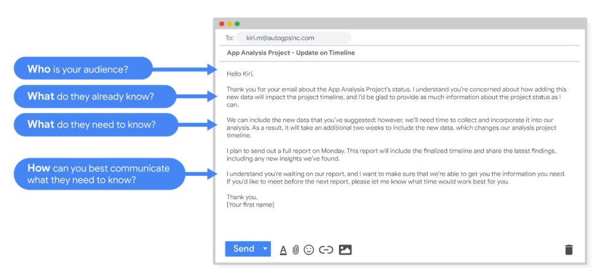
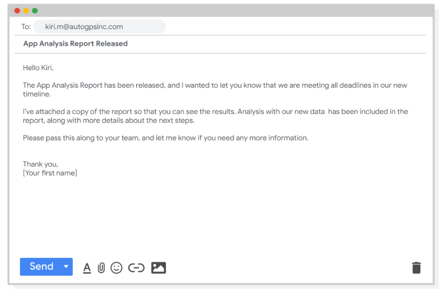

# Working with stakeholders

Your data analysis project should answer the business task and create opportunities for data-driven decision-making. That's why it is so important to focus on project stakeholders. As a data analyst, it is your responsibility to understand and manage your stakeholders’ expectations while keeping the project goals front and center.

You might remember that stakeholders are people who have invested time, interest, and resources into the projects that you are  working on. This can be a pretty broad group, and your project stakeholders may change from project to project. But there are three common stakeholder groups that you might find yourself working with: the executive team, the customer-facing team, and the data science team.

## Executive team

The executive team provides strategic and operational leadership to the company. They set goals, develop strategy, and make sure that strategy is executed effectively. The executive team might include vice presidents, the chief marketing officer, and senior-level professionals who help plan and direct the company’s work. These stakeholders think about decisions at a very high level and they are looking for the headline news about your project first.  They are less interested in the details. Time is very limited with them, so make the most of it by leading your presentations with the answers to their questions. You can keep the more detailed information handy in your presentation appendix or your project documentation for them to dig into when they have more time. 

## Customer-facing team

The customer-facing team includes anyone in an organization who has some level of interaction with customers and potential customers. Typically they compile information, set expectations, and communicate customer feedback to other parts of the internal organization. These stakeholders have their own objectives and may come to you with specific asks. It is important to let the data tell the story and not be swayed by asks from your stakeholders to find certain patterns that might not exist. 

## Data science team

Organizing data within a company takes teamwork. There's a good chance you'll find yourself working with other data analysts, data scientists, and data engineers. For example, maybe you team up with a company's data science team to work on boosting company engagement to lower rates of employee turnover. In that case, you might look into the data on employee productivity, while another analyst looks at hiring data. Then you share those findings with the data scientist on your team, who uses them to predict how new processes could boost employee productivity and engagement. When you share what you found in your individual analyses, you uncover the bigger story. A big part of your job will be collaborating with other data team members to find new angles of the data to explore.

## Working effectively with stakeholders

When you're working with each group of stakeholders- from the executive team, to the customer-facing team, to the data science team, you'll often have to go beyond the data. Use the following tips to communicate clearly, establish trust, and deliver your findings across groups.

**Discuss goals**. Stakeholder requests are often tied to a bigger project or goal. When they ask you for something, take the opportunity to learn more. Start a discussion. Ask about the kind of results the stakeholder wants. Sometimes, a quick chat about goals can help set expectations and plan the next steps.

**Feel empowered to say “no.”** Let’s say you are approached by a marketing director who has a “high-priority” project and needs data to back up their hypothesis. They ask you to produce the analysis and charts for a presentation by tomorrow morning. Maybe you realize their hypothesis isn’t fully formed and you have helpful ideas about a better way to approach the analysis. Or maybe you realize it will take more time and effort to perform the analysis than estimated. Whatever the case may be, don’t be afraid to push back when you need to. 

Stakeholders don’t always realize the time and effort that goes into collecting and analyzing data. They also might not know what they actually need. You can help stakeholders by asking about their goals and determining whether you can deliver what they need. If you can’t, have the confidence to say “no,” and provide a respectful explanation. If there’s an option that would be more helpful, point the stakeholder toward those resources. If you find that you need to prioritize other projects first, discuss what you can prioritize and when. When your stakeholders understand what needs to be done and what can be accomplished in a given timeline, they will usually be comfortable resetting their expectations. You should feel empowered to say no-- just remember to give context so others understand why. 

**Plan for the unexpected.** Before you start a project, make a list of potential roadblocks. Then, when you discuss project expectations and timelines with your stakeholders, give yourself some extra time for problem-solving at each stage of the process.

**Know your project.** Keep track of your discussions about the project over email or reports, and be ready to answer questions about how certain aspects are important for your organization. Get to know how your project connects to the rest of the company and get involved in providing the most insight possible. If you have a good understanding about why you are doing an analysis, it can help you connect your work with other goals and be more effective at solving larger problems. 

**Start with words and visuals.** It is common for data analysts and stakeholders to interpret things in different ways while assuming the other is on the same page. This illusion of agreement* has been historically identified as a cause of projects going back-and-forth a number of times before a direction is finally nailed down. To help avoid this, start with a description and a quick visual of what you are trying to convey. Stakeholders have many points of view and may prefer to absorb information in words or pictures. Work with them to make changes and improvements from there. The faster everyone agrees, the faster you can perform the first analysis to test the usefulness of the project, measure the feedback, learn from the data, and implement changes.

**Communicate often.** Your stakeholders will want regular updates on your projects. Share notes about project milestones, setbacks, and changes. Then use your notes to create a shareable report. Another great resource to use is a change-log, which is a tool that will be explored further throughout the program. For now, just know that a change-log is a file containing a chronologically ordered list of modifications made to a project. Depending on the way you set it up, stakeholders can even pop in and view updates whenever they want.

# Use multiple communication strategies to reach your audience

Being able to communicate in multiple formats is a key skill for data analysts. Listening, speaking, presenting, and writing skills will help you succeed in your projects and in your career. This reading covers effective communication strategies, including examples of clearly worded emails for common situations.

Here's an important first tip: Know your audience! When you communicate your analysis and recommendations as a data analyst, it's vital to keep your audience in mind. 

Be sure to answer these four important questions related to your audience:

- Who is your audience? 

- What do they already know? 

- What do they need to know? 

- How can you best communicate what they need to know? 

## Project example 
As a data analyst, you'll get plenty of requests and questions through email. Let’s walk through an example of how you might approach answering one of these emails. Assume you're a data analyst working at a company that develops mobile apps. Let's start by reviewing answers to the four audience questions we just covered:

 
Kiri, Product Development Project Manager

 
Kiri received updates about our project from its planning stages, including the most recent project report, sent two weeks ago.

 
Kiri needs an update on the analysis project’s progress and needs to know that the executive team approved changes to the data and timeline. You know that adding a new variable to the analysis will impact the current project timeline. Kiri will need to change the project’s milestones and completion date.

 
You can start by sending an email update to Kiri with the latest timeline for the project, but a meeting might be necessary if she wants to talk through her concerns about missing a deadline.

## Updated timeline email sample
After answering the audience questions, you have the key building blocks you need to write an email to Kiri. Here's an example of how these questions can help organize the flow of the email message: 
 
After receiving your email, Kiri will have a clearer view of the changes to the analysis project and will be able to make adjustments to work with the new timeline. 

## Project follow-up email sample
After the next report is completed, you can also send out a project update offering more information. The email could look like this: 
 

Good communication keeps stakeholders updated on progress and ultimately helps prevent problems. Carefully worded responses are key. Whether you gather and address feedback using email, meetings, or reports, everyone you work with will know what to expect. As a result, they will be able to better manage their own schedules, resources, and teams.